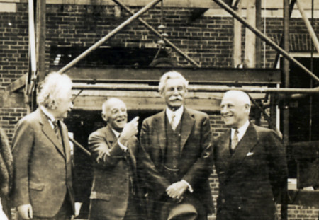

[Nature Podcast](https://www.nature.com/nature/articles?type=nature-podcast) was my first introduction to research. It was a pleasing experience listening to novel discoveries and researchers sharing their excitement about it. The candid way in which it's presented gave me the impression that anyone with an inquisitive mind ready to fully involve with perseverance can share the same joy and excitement.

[Hakob Barseghyan's](https://hps.utoronto.ca/staff/hakob-barseghyan) lecture on [History and Philosophy of Science](https://www.youtube.com/channel/UC7Tb7zZldhJfxRCxJY52uMg) was my next wonder moment! The big picture of Science and how it is pursued just got revealed. My outlook on History and Philosophy also turned around. I realized that there is nothing absolute in science. We are only progressing towards the truth and reality. Openly accepting that our theory is fallible. History also reveals that there is not even an absolute method of science. Aristotelians had the intuitive truth as the method albeit now we have the Hypothetico-deductive method instead. This encouraged me to hypothesis and imagine without being limited by the worries of failure to grasp the absolute truth. I begin to appreciate the past theories of science. Not labeling them as absolutely wrong and our current theories as absolutely true.

I was also curious to know how mathematicians solve problems. What approach do they use enabling them to tackle the most difficult problems and come up with brilliant and rigorous proofs? George Pólya was conscious of this and he identifies certain [principles of problem-solving](https://math.berkeley.edu/~gmelvin/polya.pdf). I was also excited to know his [attitude toward teaching](https://youtu.be/h0gbw-Ur_do). Polya's approach and attitude gave me the confidence and clarity to go forward with my research.
